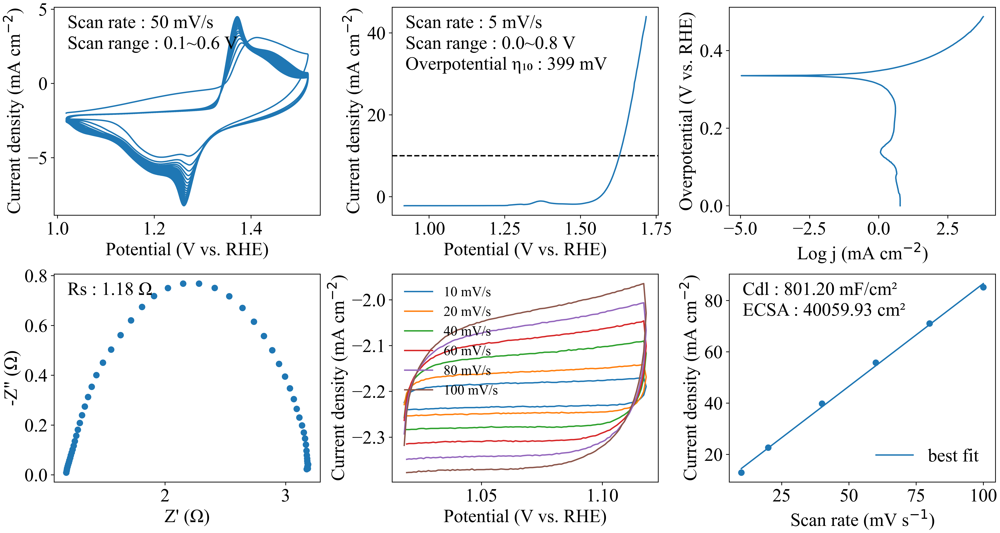

# 辰华CHI电化学工作站测试数据一键绘图！

这个脚本用于将辰华CHI电化学工作站测试的OER数据一键绘图，做到真正的解放双手！

## 目录

- [辰华CHI电化学工作站测试数据一键绘图！](#辰华chi电化学工作站测试数据一键绘图)
  - [目录](#目录)
  - [依赖库](#依赖库)
  - [用法](#用法)
    - [准备数据文件](#准备数据文件)
    - [运行脚本](#运行脚本)
  - [结果展示](#结果展示)
  - [作者](#作者)
  - [License](#license)


## 依赖库

运行该脚本需要安装以下python第三方库：

- [numpy](https://numpy.org/)
- [pandas](https://pandas.pydata.org/)
- [matplotlib](https://matplotlib.org/)

如果您是 Python 新手，强烈推荐您安装使用[Anaconda](https://www.anaconda.com/)，这是一个内置了很多常用的python第三方库的开源的包、环境管理器，使用它可以在同一个机器上安装不同版本的软件包及其依赖，并能够在不同的环境之间切换，可以省去很多的烦恼。

## 用法

### 准备数据文件

这个项目提供了.py脚本和.ipynb脚本，具有相同的功能，运行该脚本需要路径下存在以下数据的.txt文件：

- `*CV*.txt`: 循环伏安法数据（文件名中需要包含关键词“CV”）.
- `*LSV*.txt`: 线性扫描伏安法数据（文件名中需要包含关键词“LSV”）.
- `*EIS*.txt`: 电化学阻抗谱数据（文件名中需要包含关键词“EIS”）.
- `*Cdl*.tst`: 在非法拉第区间宽度为0.1 V的电势窗口以不同扫速扫描的循环伏安数据（文件名中需要包含关键词“Cdl”），用于计算双电层电容$C_{dl}$和电化学活性面积ECSA.

脚本所在路径scripts_dir下文件的结构应该是这样：

```
scripts_dir
├── *CV*.txt
├── *LSV*.txt
├── *EIS*.txt
├── *Cdl*.tst
├── ...
```
*注意：其中不同扫速CV的数据文件`*Cdl*.tst`可以有多个。

### 运行脚本

如果安装了python3并且以添加到系统环境变量，双击该.py脚本即可自动执行，大约几秒钟后便可运行结束，生成图形。

## 结果展示

成功运行脚本之后会生成`results.png`文件，内容如下图所示：



## 作者

该软件主要由LiYIhang在[冯凌燕](https://www.x-mol.com/groups/flygroup)教授的指导下编写。

## License

该脚本工具是在 MIT 许可下发布的。